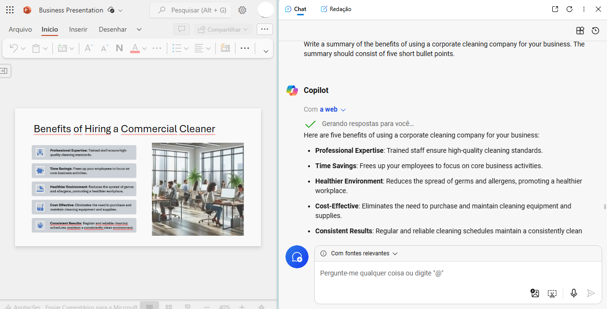

# Plano de negócios desenvolvido com assistência da I.A. MS Copilot atráves do browser MS Edge

Este projeto é um laboratório criado pelo Microsoft Learning que está disponível em <https://aka.ms/ai900-bing-copilot> e que foi acessado na data de 14/ago/2024.

A cópia PDF está anexa neste mesmo projeto no arquivo [Explore Microsoft Copilot in Microsoft Edge](mslearn-ai-fundamentals.pdf). O laboratório fornece o arquivo [Business Idea](Business-Idea.docx). Então, segue-se uma série de instruções à Inteligência Artificial MS Copilot disponível no browser MS Edge; a série de prompts está no arquivo [prompts.md](prompts.md). As instruções incluem:
- a geração de imagens para criar a logomarca;
- a produção de uma apresentação; eis o arquivo: [Business Presentation](Business-Presentation.pptx);
- a geração de um esboço de mensagem de e-mail, disponibilizado na resposta ao Prompt 10 no arquivo [prompts.md](prompts.md).

#### Print da tela à modo de exemplo da efetuação do laboratório.
 